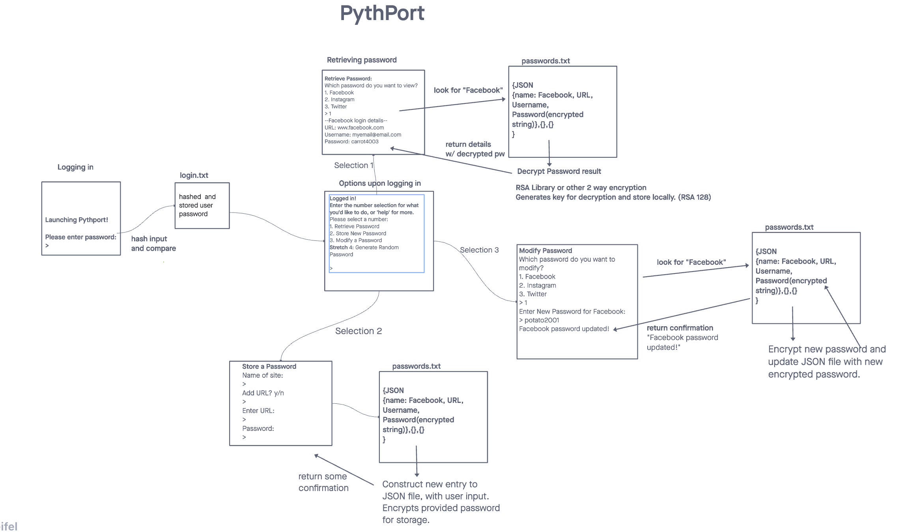

# Pythport Password Manager

## MVP User Stories

* As a user I want to have a safe location to store my passwords
  * Secured by master login
  * Allows for storage of passwords, usernames, URLS, and custom titles
* As a user I want to be able retrieve saved passwords to use on websites
  * User can view saved details, including password, username, URL
* As a user I wanted to be able to view which websites I have passwords stored on
  * User will be given the option to view saved logins, and select a login while browsing
* As a user I want have a streamlined user interface experience with the application
  * Each step of CLI will be clear
  * User will navigate using number inputs ("1", "2", "3")
* As a user I want to access to instructions and help like features
  * At any time, user can enter "help" for more detailed instructions about app use.

## Stretch Goal User Stories

* As a user I want the app to randomly generate passwords if prompted while modifying or saving a new password.
* As a user I want the app to automatically log me into websites that I've saved passwords for

## Whiteboard Process

## Attributions

[PyCryptodome Docs](https://pycryptodome.readthedocs.io/en/latest/src/protocol/kdf.html)